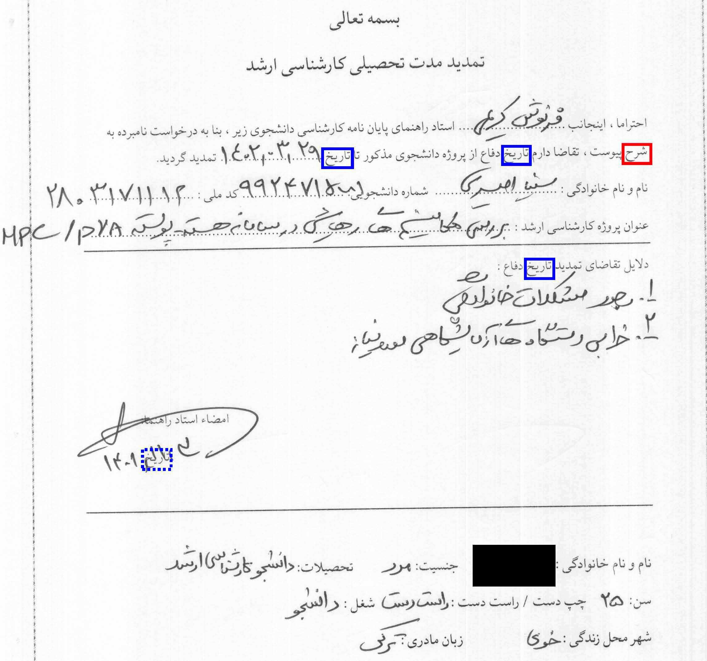

# 📝 Persian Keyword Spotting — "تاریخ" in Handwritten Forms

Detect the printed Persian keyword **"تاریخ"** ("date") in scanned handwritten forms using **Mask R-CNN** with custom anchors and data augmentation.

  

---

## 📌 Overview
This project implements a deep learning pipeline to **detect the printed keyword "تاریخ"** in Persian (Farsi) handwritten forms.  
The system is designed for automating document processing tasks such as:
- Locating handwritten dates next to the keyword
- Enabling fast document indexing
- Supporting downstream applications in information retrieval

Our approach uses **Mask R-CNN** (which is implemented by [Matterport](https://github.com/matterport/Mask_RCNN) ) with:
- **Transfer learning** from [MS COCO dataset](http://cocodataset.org/#home)
- **Custom anchor optimization** for Persian word shapes
- **Data augmentation** to boost recall and robustness

---

## ✨ Features
- **Specialized Persian Keyword Detection**: Optimized for the printed word "تاریخ" in Persian forms, enabling precise location of adjacent handwritten date fields.
- **Transfer Learning on Mask R-CNN**: Uses a backbone pre-trained on the MS COCO dataset to reduce training time and improve performance with limited data.
- **Custom Anchor Configuration**: Modified anchor sizes and aspect ratios specifically tuned for Persian printed word proportions.
- **Robust Data Augmentation**:
  - Rotation between -10 to 10 degrees
  - Translation up to 10% of image dimensions
  - Contrast enhancement (1.5× pixel intensity std)
  - Gaussian blur (σ between 0 and 2)
  - Gaussian noise (std ≤ 5% of dynamic range)
- **Performance-Tuned Training**:
  - Optimized to achieve **high recall** with default anchors
  - Optimized to achieve **high precision** with modified anchors
- **Small Dataset Friendly**: Designed to work effectively with only 500 training+validation images via augmentation.
- **Error Analysis-Driven Improvements**:
  - Removed rotation augmentation after experiments showed it reduced performance
  - Adjusted anchor ratios based on detection errors caused by Persian script similarities
- **Multi-Format Support**: Works on **TIFF, JPG, PNG** scanned forms at A4 300dpi resolution.
- **Privacy-Conscious Dataset**: Personal information in images is obscured while preserving detection regions.

## 📂 Dataset

> **Persian "تاریخ" Keyword Spotting Dataset** — A curated collection of Persian handwritten forms for printed keyword detection.

| 📌 Attribute | 📄 Details |
|--------------|-----------|
| 🗂 **Forms** | 25 unique templates from various administrations |
| 🔤 **Fonts** | 12 common Persian fonts in multiple sizes |
| 🖊 **Contributors** | Filled by 36 individuals |
| 📊 **Total Samples** | 300 forms (200 train, 50 val, 50 test) |
| 🔍 **Keyword Instances** | 792 occurrences of "تاریخ"   (528 train, 132 val, 132 test) |
| ⚖ **Balance** | Uniform distribution across splits |
| 🏷 **Labeling** | "تاریخ" manually labeled in all forms |
| 🖼 **Augmentation** | Doubled training & validation sets using transformations |
| 📠 **Acquisition** | Printed & scanned with HP Scanjet 4500/5550 (A4, 300dpi grayscale) |
| 📏 **Image Size** | Original 2480×3503 px TIFF → resized to 1024×1024 px |
| 🔒 **Privacy** | Lower parts of images obscured; handwritten text mostly invalid |
| 📧 **Access** | Request via `mj.gholami96@gmail.com` (include purpose of use) |

  

