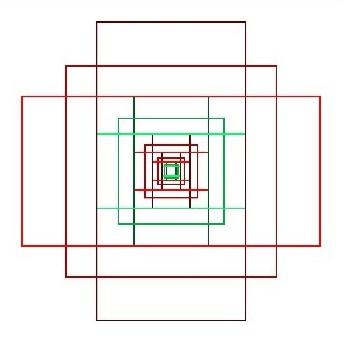
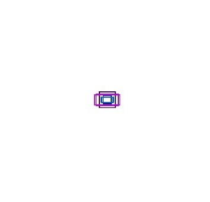

# 📝 Persian Keyword Spotting — "تاریخ" in Handwritten Forms

Detect the printed Persian keyword **"تاریخ"** ("date") in scanned handwritten forms using **Mask R-CNN** with custom anchors and data augmentation.

<p align="center">
  
</p>

---

## 📌 Overview
This project implements a deep learning pipeline to **detect the printed keyword "تاریخ"** in Persian (Farsi) handwritten forms.  
The system is designed for automating document processing tasks such as:
- Locating handwritten dates next to the keyword
- Enabling fast document indexing
- Supporting downstream applications in information retrieval

Our approach uses **Mask R-CNN** (which is implemented by [Matterport](https://github.com/matterport/Mask_RCNN) ) with:
- **Transfer learning** from [MS COCO dataset](http://cocodataset.org/#home)
- **Custom anchor optimization** for Persian word shapes
- **Data augmentation** to boost recall and robustness

---

## ✨ Features
- **Specialized Persian Keyword Detection**: Optimized for the printed word "تاریخ" in Persian forms, enabling precise location of adjacent handwritten date fields.
- **Transfer Learning on Mask R-CNN**: Uses a backbone pre-trained on the MS COCO dataset to reduce training time and improve performance with limited data.
- **Custom Anchor Configuration**: Modified anchor sizes and aspect ratios specifically tuned for Persian printed word proportions.
- **Robust Data Augmentation**: Five different data augmentation techniques were used.
- **Performance-Tuned Training**:
  - Optimized to achieve **high recall** with default anchors
  - Optimized to achieve **high precision** with modified anchors
- **Small Dataset Friendly**: Designed to work effectively with only 500 training+validation images via augmentation.
- **Error Analysis-Driven Improvements**:
  - Removed rotation augmentation after experiments showed it reduced performance
  - Adjusted anchor ratios based on detection errors caused by Persian script similarities
- **Multi-Format Support**: Works on **TIFF, JPG, PNG** scanned forms at A4 300dpi resolution.
- **Privacy-Conscious Dataset**: Personal information in images is obscured while preserving detection regions.

## 📂 Dataset

> **Persian "تاریخ" Keyword Spotting Dataset** — A curated collection of Persian handwritten forms for printed keyword detection.

| 📌 Attribute | 📄 Details |
|--------------|-----------|
| 🗂 **Forms** | 25 unique templates from various administrations |
| 🔤 **Fonts** | 12 common Persian fonts in multiple sizes |
| 🖊 **Contributors** | Filled by 36 individuals |
| 📊 **Total Samples** | 300 forms (200 train, 50 val, 50 test) |
| 🔍 **Keyword Instances** | 792 occurrences of "تاریخ" <br> (528 train, 132 val, 132 test) |
| ⚖ **Balance** | Uniform distribution across splits |
| 🏷 **Labeling** | "تاریخ" manually labeled in all forms |
| 🖼 **Augmentation** | Doubled training & validation sets using transformations |
| 📠 **Acquisition** | Printed & scanned with HP Scanjet 4500/5550 (A4, 300dpi grayscale) |
| 📏 **Image Size** | Original 2480×3503 px TIFF → resized to 1024×1024 px |
| 🔒 **Privacy** | Lower parts of images obscured; handwritten text mostly invalid |
| 📧 **Access** | Request via `mj.gholami96@gmail.com` (include purpose of use) |

<p align="center">
  
  
</p>

## 🧠 Method

This project detects the printed Persian keyword **"تاریخ"** in scanned handwritten forms using a **Mask R-CNN** pipeline optimized for limited-data scenarios.

### 1) Model & Training Strategy
- **Architecture:** Mask R-CNN ([Matterport](https://github.com/matterport/Mask_RCNN) implementation) with a backbone pre-trained on **[MS COCO dataset](http://cocodataset.org/#home)**.
- **Transfer Learning:** Only the **heads** (RPN + classifier/regressor) are trained; deeper backbone layers remain frozen.
- **Input Size:** Images are resized to **1024×1024** pixels (grayscale converted to 3-channel stack).
- **Loss Functions:** Cross-Entropy for classification, Smooth L1 for bounding box regression.
- **Evaluation Metric:** mAP@IoU=0.5 along with Precision, Recall, and F1-score.

### 2) Anchor Optimization (RPN)
To match the elongated proportions of Persian printed words, the RPN anchor configuration was customized:
```python
# configs/mask_rcnn_config.py (snippet)
RPN_ANCHOR_SCALES    = (64, 32)       # default: (512, 256, 128, 64, 32)
RPN_ANCHOR_RATIOS    = [2.5, 2.0, 1.0]  # default: [2, 1, 0.5]
RPN_ANCHOR_STRIDE    = 1
RPN_NMS_THRESHOLD    = 0.7
DETECTION_MIN_CONFIDENCE = 0.7
```
<p align="center">
  
  
</p>

### 3) Data Augmentation
Augmentation techniques used to increase dataset diversity and improve robustness:

- Rotation between -10 to 10 degrees
- translation: up to ±10% of image dimensions
- contrast: scale standard deviation by 1.5
- gaussian_blur: σ between 0 and 2
- gaussian_noise: std ≤ 5% of dynamic range

Note: Rotation was removed after error analysis showed it degraded performance due to anchor orientation mismatch.

## 📊 Results

The model was evaluated under four different scenarios:  
1. Default anchors — without augmentation  
2. Modified anchors — without augmentation  
3. Default anchors — with augmentation  
4. Modified anchors — with augmentation  

Performance metrics were calculated at IoU = 0.5:

| Scenario | Precision (%) | Recall (%) | F1-score (%) | Test mAP (%) |
|----------|---------------|------------|--------------|--------------|
| Default anchors (no aug) | 91.2 | 86.3 | 88.6 | 85.73 |
| Modified anchors (no aug) | 89.8 | 87.1 | 88.4 | 87.46 |
| **Default anchors + Augmentation** | 92.8 | **97.7** | **95.1** | **98.1** |
| **Modified anchors + Augmentation** | **99.1** | 90.9 | 94.8 | 92.96 |

### Key Observations
- **Highest recall** was achieved with default anchors and augmentation (97.7%).  
- **Highest precision** was achieved with modified anchors and augmentation (99.1%).  
- Anchor modification increased precision but reduced recall.  
- Data augmentation significantly improved recall across both anchor configurations.

### Evaluation Charts
- Default anchor scenario in two stages of training and validation

<p align="center">
  
  
  
</p>
